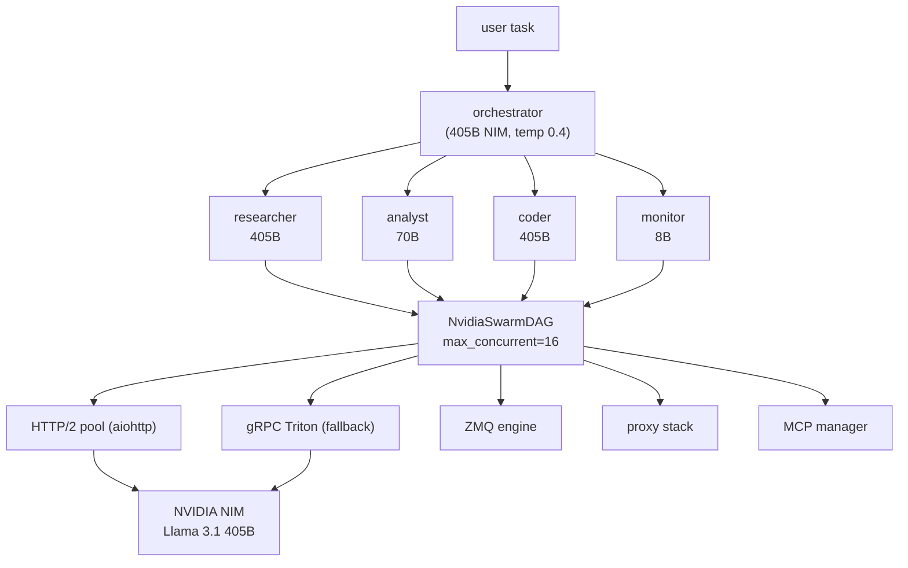

<div align="right">


</div>

# nvidia-swarm-lens
### An agent swarm that runs on NVIDIA NIM — lens-first, DAG-executed, async all the way down.

`nvidia-swarm-lens` is a multi-agent orchestration stack: specialized agents (researcher, analyst, coder, monitor) fan out over a directed acyclic graph, each through a **lens profile** — optimized model selection, temperature, and KV-cache strategy per agent type — all transported over persistent HTTP/2 to NVIDIA NIM with a gRPC Triton fallback.

## Why this exists

Serial `agent.run()` loops waste the one thing inference gives you for free: parallelism. The swarm replaces the serial loop with a DAG, packs each agent as a prompt (stateless transport, optimal KV-cache), and constrains tool calls with grammar decoding so JSON is valid by construction — no retry logic, no prayer.

## What it does

- **`swarm/` — the swarm core**: `NvidiaSwarm` DAG execution (`max_concurrent=50`), `NvidiaAgent` workers, `NvidiaNIMClient` transport, `ZMQEngine` + `ZMQTool` messaging, `ProxyStack` + `DaemonTunnel` egress, `MCPManager` tool wiring, `GitPushHelper`, `UnshareRoot` isolation, `EnvdMimicry`.
- **`lens/` — lens profiles**: per-agent-type optimized model/temperature/KV-cache configs (`lens/profiles.py`, `build_swarm_from_lens`); specialty lenses for OSINT, cryptographic, stylometric, anthropological, and insectoid analysis.
- **`launcher.py`** — main entry point: wires transport (live NIM or mock), ZMQ, proxy, MCP, git, unshare, envd into a running swarm.
- **`osint_runner.py` / `bin/osint_runner.py`** — OSINT runner: headless Chrome via `nodriver`, stdlib-only, phased page rendering and extraction.
- **`case_studies/`** — real deployments, e.g. `001_groq_compound_mini_deprecation`: full OSINT on Groq's Compound Mini deprecation (raw email, migration guide, swarm task manifest, OSINT report).
- **`skills/`** — agent skill packs, including `fast-browser-use` research-grade browser automation.
- **`mcp_servers.json`, `configs/`** — MCP server registry and huh-manifest configs.
- **`docs/ARCHITECTURE.md`, `docs/BENCHMARK_BASELINES.md`** — design docs and baselines.

## Architecture



Design principles (from `docs/ARCHITECTURE.md`):

1. **Async-first** — every agent runs via `asyncio` with `aiohttp` HTTP/2 persistent connections.
2. **DAG execution** — parallelized directed acyclic graph replaces the serial `run()`.
3. **Grammar-constrained decoding** — regex/BNF guarantees valid JSON tool calls; no retry logic.
4. **Lens profiles** — each agent type gets optimized model selection, temperature, KV-cache strategy.
5. **Stateless transport** — context windows packed for optimal KV-cache; agents exist as packed prompts.

## Quick start

```bash
./setup.sh                                                   # load binaries via loader.py
python3 loader.py test                                       # smoke test
python3 launcher.py --mock --task "summarize this repo"      # swarm task on mock transport
```

Live NIM transport when `NVIDIA_API_KEY` is set (omit `--mock`); `--lenses research,code,analysis` picks lens profiles, `--stream` enables token streaming, `--full-demo` runs every demo.

## Config

Environment (see [`.env.example`](.env.example) — never hardcode secrets, inject via env or vault):

| Variable | Purpose |
|---|---|
| `NVIDIA_API_KEY` | live NIM transport (absent → mock transport) |
| `GITHUB_TOKEN` | `GitPushHelper` pushes |
| `LENS_ENABLED` | lens-profile routing on/off |
| `LENS_SWARM_CONCURRENCY` / `SWARM_MAX_CONCURRENCY` | fan-out ceilings |
| `SWARM_TIMEOUT_MS` | per-task timeout (default 30000) |
| `MCP_TRANSPORT` | MCP transport (`stdio`) |
| `ZEDRA_DAEMON_HOST` | zedra daemon endpoint |

## Case study: Groq Compound Mini deprecation

`case_studies/001_groq_compound_mini_deprecation/` — the swarm's first live deployment target (August 2026): Groq deprecated the Compound Mini model with decommission set for 2026-09-21. The case ships the raw deprecation email, a migration guide, the swarm task manifest, and the generated OSINT report — the full loop from trigger to deliverable.

## Security

- Secrets are injected via environment or runtime vault — never hardcoded (`.env.example` ships empty values).
- `UnshareRoot` and proxy/daemon tunneling isolate swarm execution; browser automation runs headless with sandbox flags.

## Dev

- `loader.py` — binary/module loading and smoke tests (`load`, `test`)
- `benchmark_repos.json` — benchmark corpus registry
- `lib/lens-orchestrator.js` — JS-side orchestration helper
- `src/_11ty/` — 11ty-rendered lens views

## License

No `LICENSE` file ships with this repo — all rights reserved unless a license is added.
