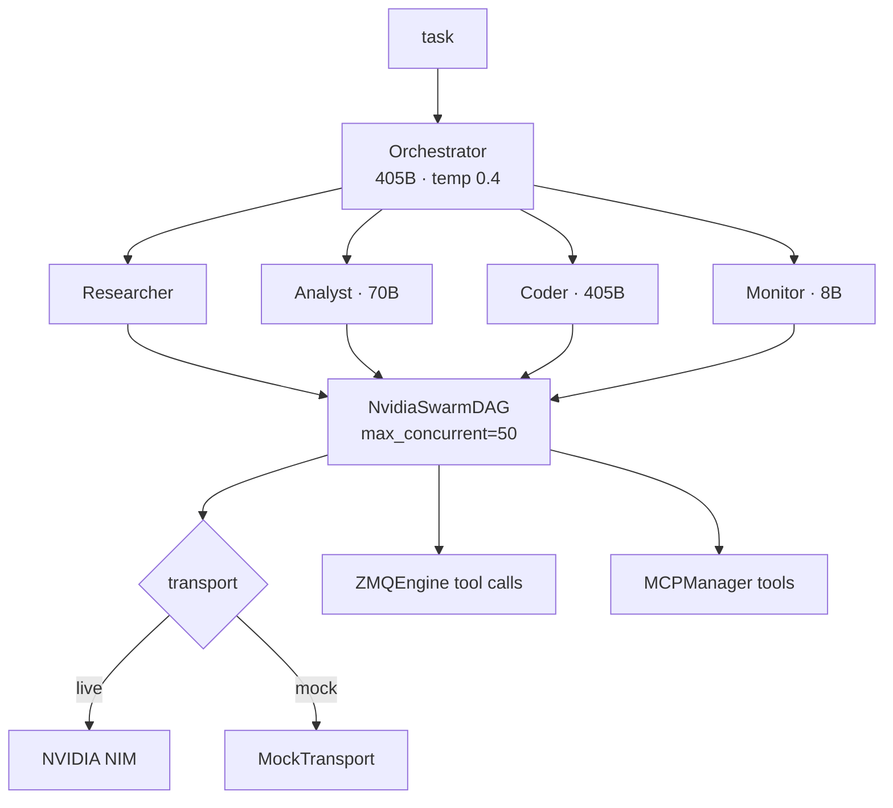

<div align="right">


</div>

# nvidia-swarm-lens

### An async multi-agent swarm framework on NVIDIA NIM — orchestrator + researcher/coder/analyst/monitor agents executing as a parallel DAG, with per-role lens profiles, ZMQ transport, MCP tooling, and a mock mode for offline development.

Give it a task; it fans out across lens-profiled agents (405B orchestrator, 70B analyst, 8B monitor), executes the plan as a directed acyclic graph instead of serial `run()` calls, and streams the results back.

---

## Features

- 🧠 **Lens profiles** — each agent role (researcher / coder / analyst / orchestrator) gets optimized model selection, temperature, and KV-cache strategy (`lens/profiles.py`)
- 🕸️ **DAG execution** — `NvidiaSwarmDAG` parallelizes agent runs (`max_concurrent=50`), replacing serial execution
- 📜 **Grammar-constrained decoding** — regex/BNF guarantees valid JSON tool calls, no retry logic
- ⚡ **Async-first transport** — `asyncio` + `aiohttp` HTTP/2 persistent connections to NVIDIA NIM
- 🔌 **ZMQ engine** — `ZMQEngine`/`ZMQTool` bypass path for low-latency tool calls
- 🧰 **MCP manager** — `MCPManager` wires MCP servers (`mcp_servers.json`) into the swarm
- 🛡️ **Proxy stack** — `ProxyStack` + `DaemonTunnel` for routed/egress-controlled operation
- 🐚 **Sandboxing** — `UnshareRoot` (namespace isolation) and `EnvdMimicry` helpers
- 🧪 **Mock transport** — full swarm runs offline with zero API spend
- 🛠️ **Agent skills** — ships `fast-browser-use` skill packs (`skills/`) for research-grade browsing



---

## Quick start

```bash
pip install -r requirements.txt
python3.12 launcher.py --mock --task "recon the target repo"
```

Go live with your key:

```bash
export NVIDIA_API_KEY            # from env — never committed
python3.12 launcher.py --task "audit this codebase" --lenses research,code,analysis,orchestrator
```

Demos: `--zmq-demo`, `--proxy-demo`, `--git-demo`, or `--full-demo` for all three. `--stream` enables streaming output. `--readme` generates a README from a swarm run.

---

## Architecture

Deep dive: [`docs/ARCHITECTURE.md`](docs/ARCHITECTURE.md) · Benchmark baselines: [`docs/BENCHMARK_BASELINES.md`](docs/BENCHMARK_BASELINES.md)

| Module | What it does |
|---|---|
| `launcher.py` | Entry point — builds the swarm from lens profiles, picks mock vs live transport |
| `swarm/nvidia_swarm_core.py` | `NvidiaSwarm` + `SwarmDAG` — agent lifecycle and parallel execution |
| `swarm/nvidia_swarm_agent.py` | `NvidiaAgent` — role agents with lens-profiled prompts |
| `swarm/nvidia_swarm_transport.py` | `NvidiaNIMClient` — live NIM chat/streaming client |
| `swarm/nvidia_swarm_zmq.py` | `ZMQEngine`, `ZMQTool` — low-latency tool-call path |
| `swarm/nvidia_swarm_mcp.py` | `MCPManager` — MCP server integration |
| `swarm/nvidia_swarm_proxy.py` | `ProxyStack`, `DaemonTunnel` — routed egress |
| `swarm/nvidia_swarm_git.py` | `GitPushHelper` — agents that commit and push |
| `swarm/nvidia_swarm_unshare.py` | `UnshareRoot` — namespace sandboxing |
| `swarm/nvidia_swarm_envd.py` | `EnvdMimicry` — environment emulation |
| `lens/profiles.py` | `ALL_LENS_PROFILES`, `build_swarm_from_lens` — role → model/temp/cache mapping |
| `case_studies/` | Worked examples (e.g. `001_groq_compound_mini_deprecation`) |

Design principles: async-first everywhere, DAG over serial, grammar-constrained tool calls (valid JSON by construction), stateless transport with packed context windows for optimal KV-cache, agents as packed prompts.

---

## Config

| Knob | Source |
|---|---|
| `NVIDIA_API_KEY` | environment (`.env` supported via `python-dotenv`) — without it the launcher falls back to mock transport |
| `GITHUB_TOKEN` | environment — used by `GitPushHelper` |
| `mcp_servers.json` | MCP server registry for `MCPManager` |
| `configs/` | `huh-manifest.json`, `mcp-huh-config.json` — harness configs |
| `--lenses` | comma-separated lens names, default `research,code,analysis,orchestrator` |

---

## Dev

```bash
pip install -r requirements.txt
python3.12 launcher.py --mock --task "smoke test"   # full offline run
python3.12 launcher.py --full-demo                  # exercise every subsystem
```

Requirements: `aiohttp>=3.9`, `python-dotenv>=1.0`, `tiktoken>=0.7`. Python 3.12 (the launcher shebang targets `python3.12`).

---

## License & security

**No `LICENSE` file is committed in this repo yet** — all rights reserved by default. Add one before reusing this code.

**Security:** `NVIDIA_API_KEY` and `GITHUB_TOKEN` come from the environment only. The swarm can execute code, push to git, and drive browsers — run untrusted tasks in mock mode or behind `UnshareRoot` first.
